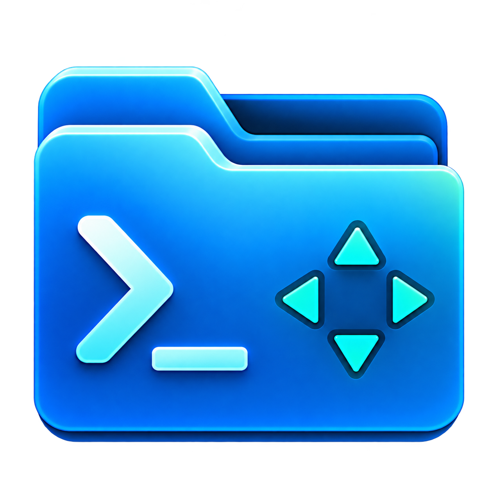
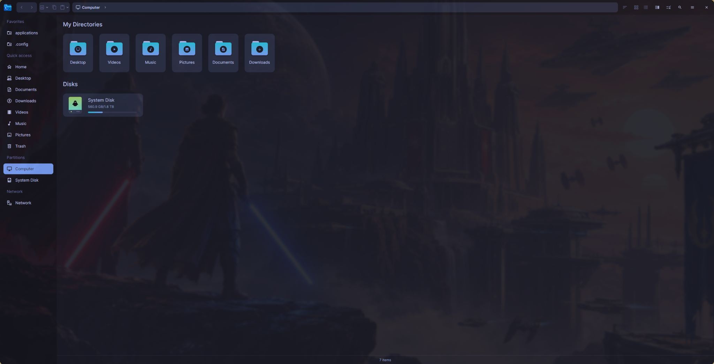
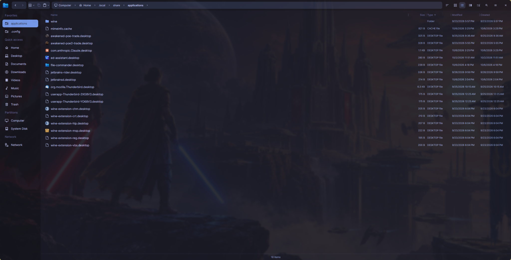
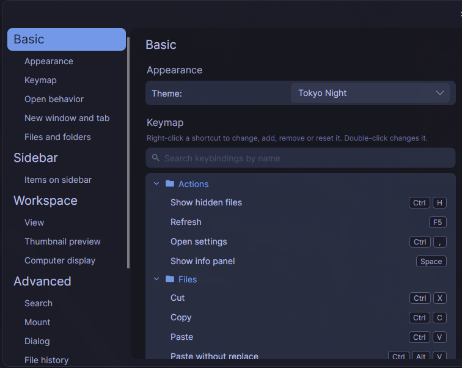
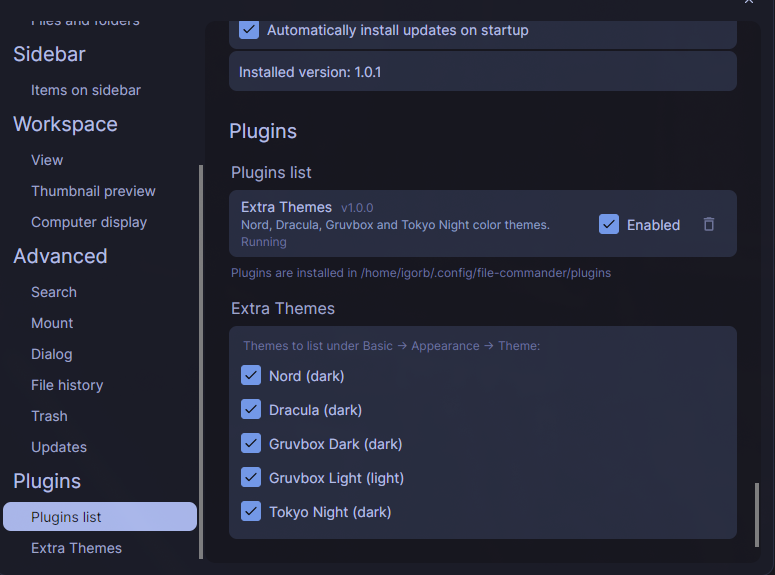
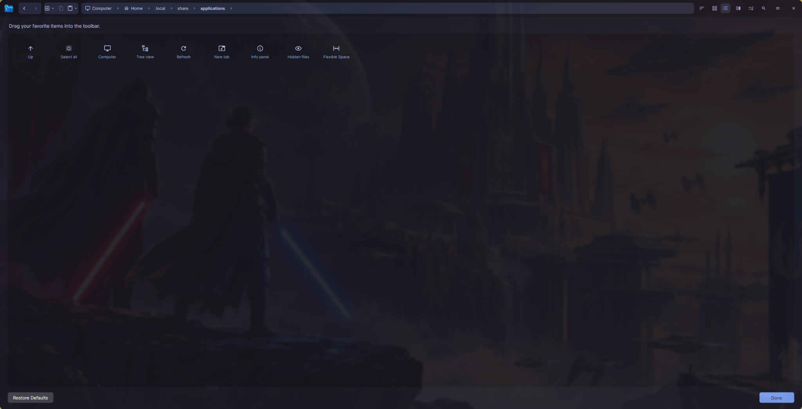

<p align="center">
  
</p>

<h1 align="center">File Commander</h1>

<p align="center">A modern, customizable file manager for Linux.</p>

<p align="center">
  <a href="https://github.com/IgorBabayan/file-commander/releases/latest"></a>
  
  
  <a href="LICENSE"></a>
</p>

File Commander brings tabbed browsing, split panes, flexible file views, and a customizable interface to everyday file management on Linux. It is built with C# and Avalonia and distributed as a self-contained AppImage.



## Contents

- [Features](#features)
- [Screenshots](#screenshots)
- [Installation](#installation)
- [Keyboard shortcuts](#keyboard-shortcuts)
- [Customization](#customization)
- [Plugins](#plugins)
- [Build from source](#build-from-source)
- [Project structure](#project-structure)
- [Contributing](#contributing)
- [License](#license)

## Features

### Browse your files

- **Tabs and split view** — keep multiple folders open and work with two panes side by side.
- **Grid, list, and tree views** — choose a layout for the task at hand.
- **Breadcrumb navigation** — navigate through parent folders or enter a path directly.
- **Customizable detail columns** — resize, reorder, and show or hide size, type, timestamps, and permissions.
- **Sidebar favorites** — drag folders into Favorites, rename their labels, and reorder sidebar entries.
- **Computer overview** — access standard user directories and view disks and storage usage.
- **Recent items and Trash** — access recently used locations and manage discarded files.
- **Hidden files and sorting** — control file extensions, folder ordering, and visible hidden entries.

### Manage files and folders

- Copy, move, rename, and delete files and folders.
- Create folders and text documents.
- Use clipboard actions and drag and drop.
- Resolve destination conflicts, or explicitly paste with or without replacement.
- Create ZIP archives and extract **ZIP, TAR, TAR.GZ, and TGZ** archives.
- Track background operations in the **Action center**, with progress and cancellation.
- View file properties, ownership, and permissions, with image previews in the info panel.
- Open files with desktop applications and display application icons for `.desktop` launchers.

### Connect and customize

- Browse mounted network locations and discover advertised SMB, SFTP, and FTP servers.
- Connect to servers through **GIO/GVfs**, with credentials or guest access where supported.
- Choose from four built-in **Catppuccin** themes.
- Customize keyboard shortcuts and the toolbar.
- Extend the application with plugins that can add pages, settings, themes, and background services.
- Enable automatic startup updates for the AppImage release.

Network features depend on the installed GVfs backends and the services available on your network.

## Screenshots

### File browser

List view with file details, breadcrumbs, and sidebar favorites.



### Settings and keyboard shortcuts

Search and customize bindings from the Settings window.



### Plugins and extra themes

The Extra Themes plugin adds Nord, Dracula, Gruvbox Dark, Gruvbox Light, and Tokyo Night.



### Toolbar customization

Drag available actions into the toolbar and arrange them to suit your workflow.



## Installation

### Download the AppImage

1. Open the [latest release](https://github.com/IgorBabayan/file-commander/releases/latest).
2. Download `File.Commander-<version>-x86_64.AppImage`.
3. Make the downloaded file executable and launch it.

For example, after saving it as `File.Commander.AppImage`:

```bash
chmod +x File.Commander.AppImage
./File.Commander.AppImage
```

**Supported platform: Linux.** Published AppImages currently target **x86_64**. The AppImage includes the .NET runtime; a separate .NET installation is not required to run it.

### Desktop launcher

To add File Commander to your application menu, create `~/.local/share/applications/file-commander.desktop`:

```ini
[Desktop Entry]
Type=Application
Name=File Commander
Comment=Modern file manager for Linux
Exec="/absolute/path/to/File.Commander.AppImage"
Icon=/absolute/path/to/file-commander.png
Categories=Utility;FileManager;
Terminal=false
StartupWMClass=file-commander
```

Replace both paths with your actual locations. The executable path is quoted so that folders containing spaces work correctly. You can use `File.Commander/File.Commander/Assets/logo.png` from the repository as the icon.

### Automatic updates

Enable **Settings → Advanced → Updates → Automatically install updates on startup**.

When running from an AppImage, File Commander checks GitHub Releases, downloads and replaces the AppImage, and restarts after running operations finish. Keep the AppImage in a location your user can write to. Automatic installation is skipped when running a development build.

### Network integration

Connecting to servers requires `gio` and suitable **GVfs** protocol backends. Install the relevant packages for your Linux distribution if network mounting is unavailable. Existing mounted shares can still appear without the `gio` tool.

## Keyboard shortcuts

These are the default bindings. Change, add, remove, or reset them under **Settings → Basic → Keymap**.

| Action | Shortcut |
| --- | --- |
| New tab / close tab | `Ctrl+T` / `Ctrl+W` |
| Next / previous tab | `Ctrl+Tab` / `Ctrl+Shift+Tab` |
| Split view | `F3` |
| Grid / list / tree view | `Ctrl+1` / `Ctrl+2` / `Ctrl+3` |
| Edit path | `Ctrl+L` or `Alt+D` |
| Back / forward | `Alt+Left` / `Alt+Right` |
| Parent folder | `Alt+Up` or `Backspace` |
| Refresh | `F5` |
| Show hidden files | `Ctrl+H` |
| Toggle info panel | `Space` |
| Cut / copy / paste | `Ctrl+X` / `Ctrl+C` / `Ctrl+V` |
| Paste without replacement | `Ctrl+Alt+V` |
| Paste with replacement | `Ctrl+Shift+V` |
| Rename | `F2` |
| Move to Trash | `Delete` |
| Delete permanently | `Shift+Delete` |
| Properties | `Alt+Enter` |
| New folder | `Ctrl+Shift+N` |
| Select all | `Ctrl+A` |
| Clear selection | `Ctrl+Shift+A` |
| Invert selection | `Ctrl+Shift+I` |
| Open settings | `Ctrl+,` |

## Customization

- **Appearance:** choose Catppuccin Latte, Frappé, Macchiato, or Mocha, or a theme supplied by a plugin.
- **Open behavior:** configure single or double click and where new tabs and windows start.
- **Sidebar:** choose visible sections and organize favorites.
- **Workspace:** choose a default folder view, image thumbnail preferences, and disk display options.
- **Toolbar:** right-click the title bar, choose **Customize Toolbar…**, then drag actions and flexible spaces into position.
- **Columns:** use the list or tree headers to adjust visibility, widths, and ordering.

Settings are stored in `settings.json` under the user's application configuration directory, normally `~/.config/file-commander/` on Linux.

## Plugins

File Commander discovers plugins from subfolders of:

```text
~/.config/file-commander/plugins/
```

Each plugin folder uses its assembly name and contains a matching DLL, for example `File.Commander.Themes/File.Commander.Themes.dll`, together with its required files.

Manage discovered plugins under **Settings → Plugins**. The repository includes an **Extra Themes** example plugin; it is built and deployed locally during Debug builds. The AppImage build script publishes the host application separately, so extra themes require the plugin to be installed.

For plugin development, see [the plugin API](File.Commander/File.Commander.Plugins/IPlugin.cs) and [the Extra Themes example](File.Commander/Plugins/File.Commander.Themes). Plugins implement `IPlugin` and can register services, provide pages and settings, or supply color themes.

## Build from source

### Requirements

- Linux
- .NET 10 SDK
- Git
- Access to NuGet for package restore
- Bash and `curl` when building an AppImage

### Run a development build

```bash
git clone --branch development https://github.com/IgorBabayan/file-commander.git
cd file-commander

dotnet restore File.Commander/File.Commander.sln
dotnet build File.Commander/File.Commander.sln --configuration Debug
dotnet run --project File.Commander/File.Commander/File.Commander.csproj
```

Debug builds also build the included plugins and copy their output into the user's plugin directory. To skip that deployment:

```bash
dotnet build File.Commander/File.Commander.sln -p:DeployPlugin=false
```

### Build an AppImage

From the repository root:

```bash
bash build/appimage/build-appimage.sh 1.0.0 artifacts
```

This publishes a self-contained `linux-x64` build, downloads `appimagetool`, and creates:

```text
artifacts/File.Commander-1.0.0-x86_64.AppImage
```

Replace `1.0.0` with the version you want to build.

### Release workflow

The [Release workflow](.github/workflows/release.yml) builds and publishes an x86_64 AppImage when a pull request is merged into `master`. It can also be run manually from `master`. Release versions use a `1.0` prefix followed by the workflow run number.

## Project structure

| Path | Purpose |
| --- | --- |
| `File.Commander/File.Commander/` | Avalonia desktop application |
| `Application/` | Settings, keymaps, dialogs, plugins, and update services |
| `Domain/Config/` | Configuration models |
| `Presentation/` | Views, view models, controls, themes, and file-management services |
| `PluginCatalog/` | Plugin discovery, loading, and removal |
| `File.Commander/File.Commander.Plugins/` | Shared plugin API |
| `File.Commander/Plugins/File.Commander.Themes/` | Extra Themes example plugin |
| `build/appimage/` | AppImage packaging script and launcher files |
| `.github/workflows/release.yml` | Release automation |

`Application/`, `Domain/Config/`, `Presentation/`, and `PluginCatalog/` are inside the desktop application directory.

The application uses **Avalonia**, **CommunityToolkit.Mvvm**, **Microsoft.Extensions.DependencyInjection**, and **Material.Icons.Avalonia**.

## Contributing

Bug reports, feature suggestions, and pull requests are welcome.

- Open an [issue](https://github.com/IgorBabayan/file-commander/issues) with reproduction steps, your Linux distribution, desktop environment, and application version.
- Branch from `development` for changes and target `development` with your pull request.
- Build the solution and check the affected behavior before submitting changes.

## License

File Commander is licensed under the [MIT License](LICENSE).
